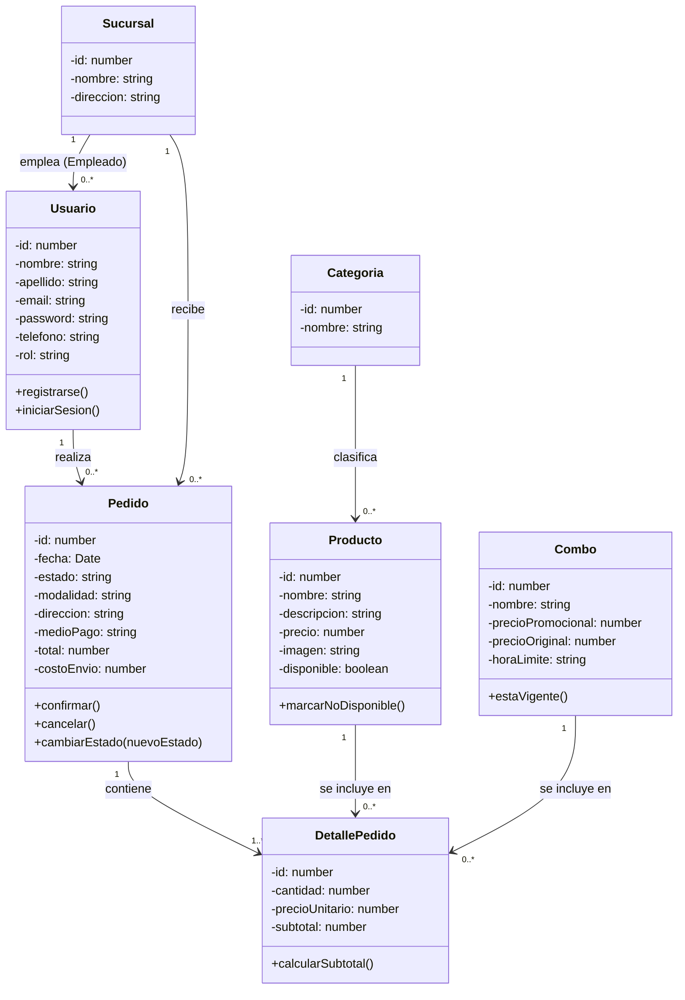

# Panchosky - Diagrama de clases (dominio)

Diagrama simple del modelo de dominio, basado en `Panchosky_Documentacion_Sistema.docx` (sección 6 - Entidades y relaciones). Sirve como guía; puede rehacerse con cualquier herramienta (draw.io, Lucidchart, etc.).

## Relación principal
Usuario (Cliente) → Pedido → DetallePedido → Producto / Combo

## Notas
- `Usuario.rol` distingue Cliente, Empleado y Administrador (RN-13, sección 4 del documento).
- `DetallePedido` une un `Pedido` con un `Producto` **o** un `Combo` (solo uno de `productoId`/`comboId` estará presente).
- El estado de `Pedido` sigue el flujo: Pendiente → Confirmado → En preparación → Listo → En camino / Listo para retirar → Finalizado (o Cancelado desde Pendiente/Confirmado).
